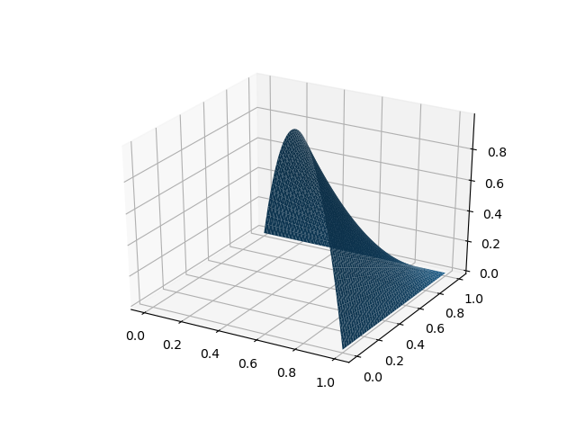
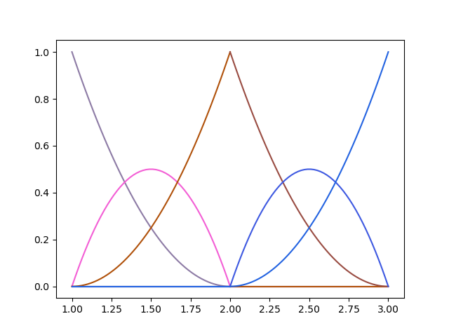
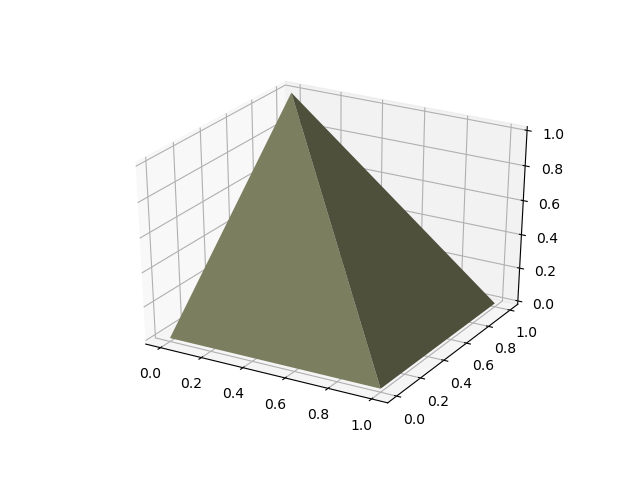
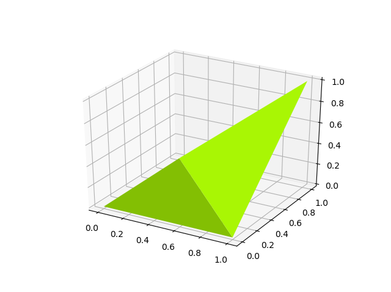

Polynomials on simplices
========================

.. image:: https://github.com/FAndersson/polynomials_on_simplices/workflows/Unit%20tests/badge.svg
   :target: https://github.com/FAndersson/polynomials_on_simplices/actions?query=workflow%3A%22Unit+tests%22
   :alt: Unit tests Status

.. image:: https://readthedocs.org/projects/polynomials-on-simplices/badge/?version=latest
   :target: https://polynomials-on-simplices.readthedocs.io/en/latest/?badge=latest
   :alt: Documentation Status

A Python package for polynomials and piecewise polynomials on simplicial
domains.

| `Polynomials <#polynomials>`__
| `Piecewise polynomials <#piecewise-polynomials>`__
| `Repository structure <#repository-structure>`__

Polynomials
-----------

The package supports degree r polynomials on an m-dimensional domain for
arbitrary r and m. Available functionality includes:

-  Polynomials expressed in the monomial basis.
-  Polynomials on an arbitrary simplex expressed in the Bernstein or
   Lagrange basis.
-  Basic arithmetic for polynomials (addition, multiplication).
-  Evaluation of polynomials.
-  Differentiation and integration of polynomials.
-  Dual bases to the monomial, Bernstein and Lagrange basis.
-  Generation of Latex strings.
-  Vector valued polynomials.

See the reference documentation for the full set of functionality,
https://polynomials-on-simplices.readthedocs.io/en/latest/.

Basic examples
~~~~~~~~~~~~~~

For example the polynomial :math:`1 + 2 x + 3 x^2` can be created by

.. code:: python

   from polynomials_on_simplices.polynomial.polynomials_monomial_basis import Polynomial
   p = Polynomial([1, 2, 3])

Working with the polynomial is then as simple as

.. code:: python

   print(p)
   print(p(1))
   print(2 * p)

Output

::

   1 + 2 x + 3 x^2
   6
   2 + 4 x + 6 x^2

The bivariate polynomial :math:`1 + 2 x_1 + 3 x_2` can be created by

.. code:: python

   p = Polynomial([1, 2, 3], r=1, m=2)
   print(p)
   print(p((1, 2)))
   print(p**2)

Output

::

   1 + 2 x_1 + 3 x_2
   9
   1 + 4 x_1 + 4 x_1^2 + 6 x_2 + 12 x_1 x_2 + 9 x_2^2

Vector valued polynomials are created by supplying vectors instead of
scalars for the polynomial coefficients,

.. code:: python

   p = Polynomial([[1, 0], [2, 1], [3, 2]])
   print(p)
   print(p(1))

Output

::

   \begin{pmatrix}1 \\ 0\end{pmatrix} + \begin{pmatrix}2 \\ 1\end{pmatrix} x + \begin{pmatrix}3 \\ 2\end{pmatrix} x^2
   [6 3]

Lagrange basis
~~~~~~~~~~~~~~

Polynomials on arbitrary simplices can be expressed in the Bernstein or
Lagrange basis.

Lagrange bases on the unit interval and unit triangle
^^^^^^^^^^^^^^^^^^^^^^^^^^^^^^^^^^^^^^^^^^^^^^^^^^^^^

Here is an example of plotting the degree 2 Lagrange basis functions on
the unit interval, using a utility plot function.

.. code:: python

   import matplotlib.pyplot as plt
   from polynomials_on_simplices.calculus.plot_function import plot_function
   from polynomials_on_simplices.polynomial.polynomials_unit_simplex_lagrange_basis import lagrange_basis
   fig = plt.figure()
   for l in lagrange_basis(2, 1):
       plot_function(l, 0.0, 1.0, fig=fig)
   plt.show()

Which produce

Similarly here is an example of plotting the (1, 0) degree 2 basis
function on the unit triangle (multivariate basis functions are indexed
using a multi-index).

.. code:: python

   import matplotlib.pyplot as plt
   from polynomials_on_simplices.calculus.plot_function import plot_bivariate_function
   from polynomials_on_simplices.geometry.primitives.simplex import unit
   from polynomials_on_simplices.polynomial.polynomials_unit_simplex_lagrange_basis import lagrange_basis_fn
   vertices = unit(2)
   l = lagrange_basis_fn((0, 1), 2)
   plot_bivariate_function(lambda x1, x2: l((x1, x2)), vertices)
   plt.show()

Which produce

Lagrange bases on general intervals and triangles
^^^^^^^^^^^^^^^^^^^^^^^^^^^^^^^^^^^^^^^^^^^^^^^^^

The examples above used the basis defined on the unit interval/triangle,
but any interval/triangle could be used. Here we instead plot the same
basis/basis function on the interval [1, 3]/triangle [[1.0, 0.0], [1.0,
1.0], [0.0, 1.0]].

.. code:: python

   import matplotlib.pyplot as plt
   from polynomials_on_simplices.calculus.plot_function import plot_function
   from polynomials_on_simplices.polynomial.polynomials_simplex_lagrange_basis import lagrange_basis_simplex
   fig = plt.figure()
   for l in lagrange_basis_simplex(2, [[1], [3]]):
       plot_function(l, 1.0, 3.0, fig=fig)
   plt.show()

Which produce

.. code:: python

   import matplotlib.pyplot as plt
   from polynomials_on_simplices.calculus.plot_function import plot_bivariate_function
   from polynomials_on_simplices.geometry.primitives.simplex import unit
   from polynomials_on_simplices.polynomial.polynomials_simplex_lagrange_basis import lagrange_basis_fn_simplex
   vertices = np.array([
       [1.0, 0.0],
       [1.0, 1.0],
       [0.0, 1.0]
   ])
   l = lagrange_basis_fn_simplex((0, 1), 2, vertices)
   plot_bivariate_function(lambda x1, x2: l((x1, x2)), vertices)
   plt.show()

Which produce

Lagrange basis on higher dimensional domains
^^^^^^^^^^^^^^^^^^^^^^^^^^^^^^^^^^^^^^^^^^^^

The polynomials are not limited to one or two dimensional domains, which
was just used above because they are easy to plot. Here is an example of
creating a Lagrange polynomial on the four dimensional unit simplex.

.. code:: python

   from polynomials_on_simplices.polynomial.polynomials_unit_simplex_lagrange_basis import PolynomialLagrange
   p = PolynomialLagrange([1, 2, 3, 4, 5], r=1, m=4)
   print(p)
   print(p((0.1, 0.2, 0.3, 0.4)))

Output

::

   l_{(0, 0, 0, 0), 1}(x) + 2 l_{(1, 0, 0, 0), 1}(x) + 3 l_{(0, 1, 0, 0), 1}(x) + 4 l_{(0, 0, 1, 0), 1}(x) + 5 l_{(0, 0, 0, 1), 1}(x)
   4.0

Dual basis
^^^^^^^^^^

The package also has support for dual bases to the polynomial basis.
Here is an example of working with the dual basis to the Lagrange basis
on the unit interval.

.. code:: python

   from polynomials_on_simplices.polynomial.polynomials_unit_simplex_lagrange_basis import dual_lagrange_basis_fn, lagrange_basis_fn
   l0 = lagrange_basis_fn(0, 2)
   l1 = lagrange_basis_fn(1, 2)
   q0 = dual_lagrange_basis_fn(0, 2)
   q1 = dual_lagrange_basis_fn(1, 2)
   print(q0(l0))
   print(q0(l1))
   print(q1(l0))
   print(q1(l1))

Output

::

   1.0
   0.0
   0.0
   1.0

Differentiation and integration
~~~~~~~~~~~~~~~~~~~~~~~~~~~~~~~

The package also supports differentiation and integration of
polynomials, here examplified using the Bernstein basis on the unit
triangle.

Differentiation
^^^^^^^^^^^^^^^

Differentiation of the polynomial
:math:`b(x) = b_{(0, 0), 2}(x) + b_{(0, 1), 2}(x)`. Partial
derivatives can be computed using the partial_derivative method. Higher
order derivatives
(:math:`\frac{\partial^2 b(x)}{\partial x_1 \partial x_2}` in this
case) can be computed using the derivative function.

.. code:: python

   from polynomials_on_simplices.polynomial.polynomials_unit_simplex_bernstein_basis import PolynomialBernstein
   b = PolynomialBernstein([1, 0, 0, 1, 0, 0], r=2, m=2)
   print(b.latex_str_expanded())
   print(b.partial_derivative(0).latex_str_expanded())
   print(b.partial_derivative(1).latex_str_expanded())
   from polynomials_on_simplices.calculus.polynomial.polynomials_calculus import derivative
   print(derivative(b, (1, 1)))

Output

::

   (1 - x_1 - x_2)^2 + 2 x_2 (1 - x_1 - x_2)
   -2 (1 - x_1 - x_2) - 2 x_2
   -2 x_2
   0

Integration
^^^^^^^^^^^

Here we integrate the linear polynomial :math:`x_1` over the unit
simplex, which as expected gives 1 / 6.

.. code:: python

   from polynomials_on_simplices.polynomial.polynomials_unit_simplex_bernstein_basis import bernstein_basis_fn
   from polynomials_on_simplices.calculus.polynomial.polynomials_calculus import integrate_unit_simplex
   b = bernstein_basis_fn((1, 0), 1)
   print(b.latex_str_expanded())
   print(integrate_unit_simplex(b))

Output

::

   0.16666666666666666

Piecewise polynomials
---------------------

The package supports piecewise polynomials and continuous piecewise
polynomials of arbitrary degree on a simplicial domain of arbitrary
dimension, expressed in the Bernstein or Lagrange basis. The available
functionality includes:

-  Basic arithmetic for piecewise polynomials (addition,
   multiplication).
-  Evaluation of piecewise polynomials.
-  Weak derivatives for continuous piecewise polynomials.
-  Restriction to a polynomial on any simplex in the domain.
-  Dual bases Bernstein and Lagrange basis.
-  Vector valued piecewise polynomials.

Here is an example of creating and plotting the quadratic Bernstein
basis for the space of piecewise polynomials on a mesh of the interval
[1, 3].

And an example of creating and plotting the linear Bernstein basis for
the space of piecewise polynomials on a mesh of the unit square.

   

   

   

Repository structure
--------------------

* **ci** - Utility tools for continuous integration.
* **docs** - Files related to documentation and automatic generation of
  documentation.
* **polynomials_on_simplices** - Source code for the package.
